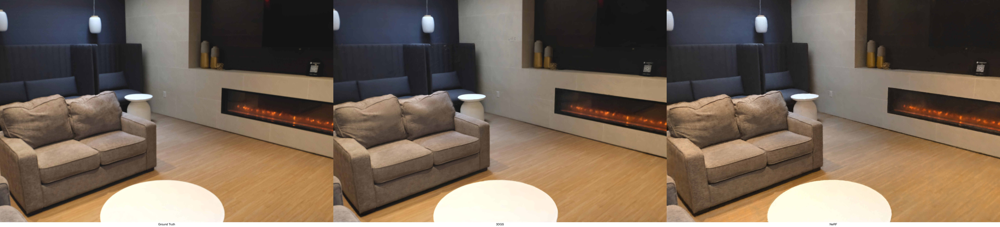
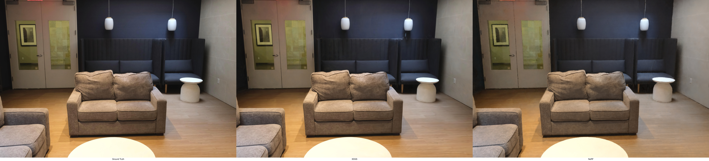
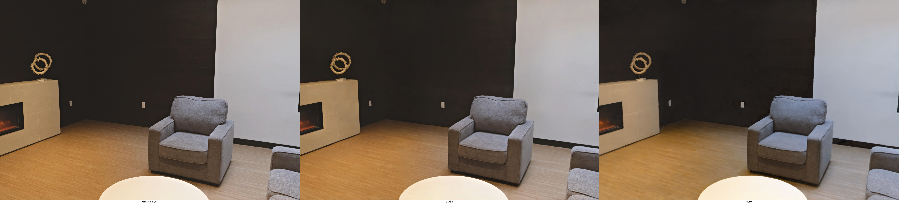
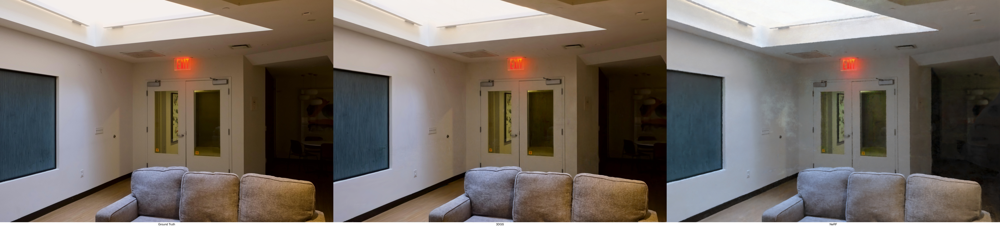
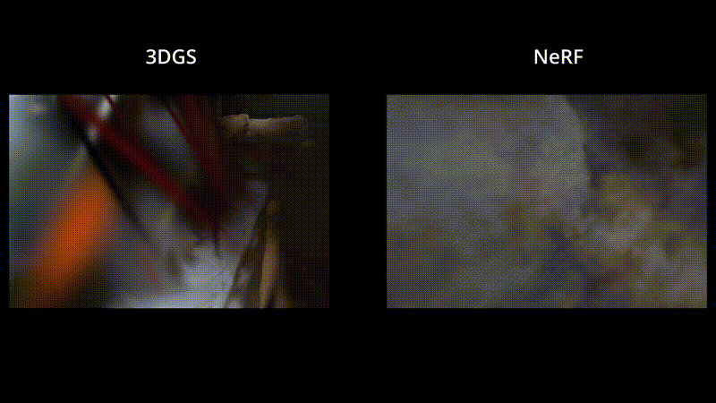
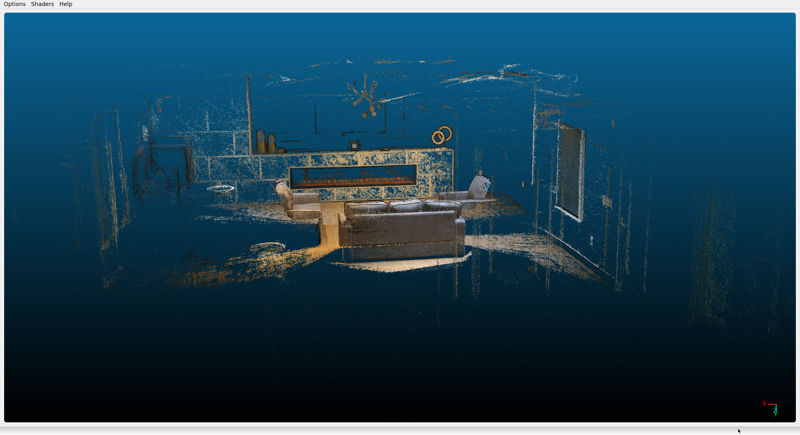
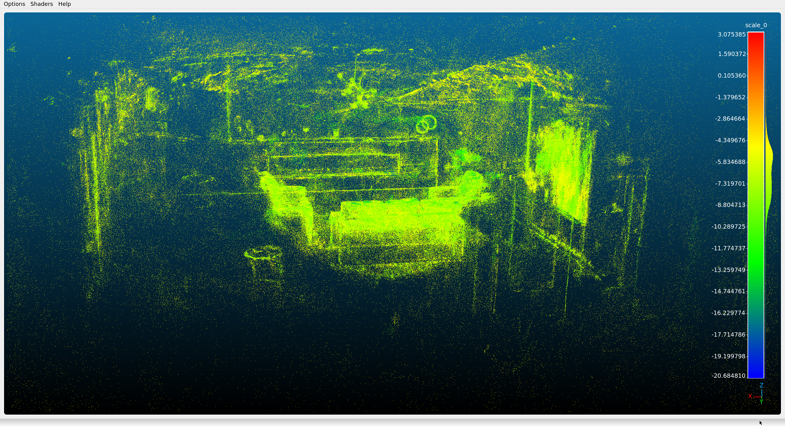
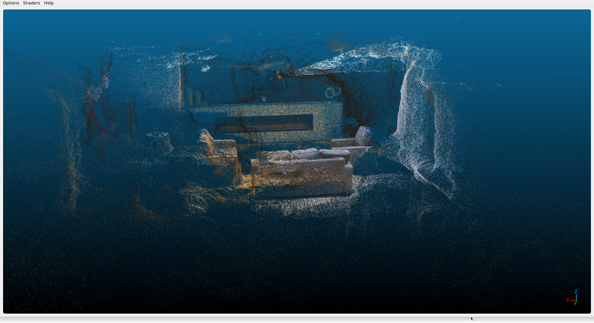

# Building a Real-World Benchmark for 3D Reconstruction

Most NeRF and 3DGS benchmarks use curated data. Either synthetic scenes, or
captures from professional multi-camera rigs under controlled lighting. The
results look impressive, but they don't answer the real-world deployment
question: **how do these methods perform with imperfect data, consumer hardware,
and a custom pipeline you built yourself?**

I didn't set out to find out whether NeRF or Gaussian Splatting is "better." I
set out to understand what it takes to go from raw photographs to 3D
reconstruction, and to scrutinize every stage along the way. Capture and
preprocessing. Toolchain compilation on newly released hardware with no
pre-built packages. Training and tuning through nerfstudio. Custom evaluation
tooling to measure what the standard tools don't.

Stack: PyTorch, Python · See the [full writeup] for a deep dive.

[VISUAL: Rendered held-out evaluations of nerfacto and splatfacto (Ground truth
on the left)]

**3DGS at 30k steps**

**NeRF at 30k steps**

## The Problem

Real captures have exposure inconsistencies, clipped data, motion in the scene,
sensor resolution limits, and challenging surfaces. Pipelines have dependency
conflicts, undocumented build failures, and tools that crash on your hardware.
Weaknesses propagate downstream. Capture quality affects SfM. SfM affects camera
poses. Poses bound what any method can reconstruct. Held-out image metrics don't
detect overfitting or measure geometric accuracy. They don't distinguish between
pretty renders and usable 3D geometry.

To figure out whether a problem lives in the data, the method, or the
evaluation, you can't look only at the output.

## Workflow

1. Capture ~100 images of an indoor space with a Fujifilm X-series mirrorless
   camera
2. Post-process for consistent exposure, color, and sharpness with
   [image-match](https://github.com/stephanbrez/image-match)
3. Process with COLMAP to produce a sparse 3D point cloud (and later a dense
   reference)
4. Train NeRF (nerfacto) and 3DGS (splatfacto) via
   [nerfstudio](https://github.com/nerfstudio-project/nerfstudio/)
5. Render each model through its training cameras, export point clouds and
   Poisson meshes
6. Evaluate and compare with
   [recon-bench](https://github.com/stephanbrez/recon-bench)

## Key Design Decisions

### 1. Manual Stills Capture

**Problem**: SfM feature matching needs consistent exposure, focus, and white
balance across views. Video captures introduce motion blur, rolling shutter, and
per-frame compression artifacts. Turnkey capture apps hide the pipeline you're
trying to learn.

**Decision**: Shot ~100 stills by hand with a Fujifilm X-series mirrorless
(16-55mm f/2.8), planning positions for baseline overlap and loop closure.
Normalized exposure, color, and sharpness across the set with a custom tool
([image-match](https://github.com/stephanbrez/image-match)).

**Outcome**: Consistent training signal into COLMAP and the radiance field
methods. The approach built intuition for capture protocol design. Normalization
partially offset the single-exposure dynamic range limit. Clipped highlights
(the skylight) can't be recovered, but cross-image exposure variation can.

### 2. Nerfstudio as a Unified Platform

**Problem**: Comparing NeRF and 3DGS across different frameworks introduces
confounding variables. Different data loaders, train/eval splits, coordinate
systems, and export pipelines make it hard to attribute differences to the
methods themselves.

**Decision**: Used nerfstudio for both nerfacto (NeRF) and splatfacto (3DGS).
Same data loader, split, coordinate system, and export pipeline. Tuned the key
parameters that defaults underrepresented: hash grid resolution and levels for
nerfacto, cull/densification thresholds and learning rate for splatfacto.

**Outcome**: A controlled comparison where method differences aren't polluted by
framework differences. Nerfstudio's CLI-driven infrastructure also made it
straightforward to add GPU profiling and structured logging for the evaluation
pipeline.

### 3. External Evaluation with recon-bench

**Problem**: Nerfstudio's `ns-eval` reports PSNR, SSIM, and LPIPS on the
held-out set only. That catches test-time image quality but misses two things:
overfitting (needs the train-vs-eval gap) and geometric accuracy (needs
point-cloud comparison). A method can produce photo-realistic novel views with
poor underlying geometry, or vice versa.

**Decision**: Built [recon-bench](https://github.com/stephanbrez/recon-bench).
It adds training-set image metrics (so the train-vs-eval gap becomes a
first-class overfitting signal) and geometric metrics (Chamfer distance,
Hausdorff distance, F-score) against COLMAP's dense point cloud. All metrics
roll up into unified reports.

**Outcome**: Rendering quality and geometric accuracy become separate questions
with separate answers. Overfitting is detectable without having to eyeball
individual renders. The tool is reusable beyond this project.

### 4. Compile-from-Source Toolchain

**Problem**: The compute platform was an NVIDIA GB10 (DGX Spark). ARM64 Grace
CPU, Blackwell GPU, CUDA 13.x. No pre-built PyTorch wheels existed for CUDA 13
on ARM64 at the time. COLMAP, nerfstudio, Open3D, and tiny-cuda-nn all needed to
be built against this specific toolchain.

**Decision**: Compile everything from source. Resolve ABI compatibility across
COLMAP (C++), PyTorch (Python/C++), tiny-cuda-nn (CUDA), and Open3D
(C++/Python). Manage CUDA compute capability flags for the Blackwell
architecture.

**Outcome**: A working pipeline on hardware no one had packaged for yet. Two
episodes worth calling out:

- **Open3D's impossible gencode pair.** The build was emitting
  `-gencode arch=compute_20,code=sm_121`. Blackwell mixed with Fermi. The fix
  required reading a layered CMake handoff as a causal chain. Open3D was
  deriving a `TORCH_CUDA_ARCH_LIST` under its auto path. PyTorch's Caffe2 CMake
  was then dismissing `CMAKE_CUDA_ARCHITECTURES` and setting it `OFF`. But
  Open3D's derived value had already been handed across. Bypass the auto path,
  pin the variables, done.
- **COLMAP fusion produced zero points.** The error message named filtering as
  the likely cause. It wasn't. After eliminating every parameter hypothesis, I
  decomposed the orchestration script and ran stages manually. Patch-match
  standalone produced valid depths, but the same invocation inside the pipeline
  produced all-zero depth maps. The remaining suspect was the CUDA driver /
  Blackwell kernel path silently producing zero-valued writes. Verifying on an
  older RTX 3080 confirmed it. I rebuilt on the 3080, transferred the dense
  point cloud back, and resumed.

## Results

[VISUAL: side-by-side renders]

[VISUAL: side-by-side interpolated flythrough of nerfacto vs splatfacto using
`ns-render interpolate` along the circular training camera path]

**3DGS outperformed NeRF on image quality.** Higher PSNR and SSIM, lower LPIPS
on both training and held-out views. Not dramatic, but consistent. The
train/eval gap was small for both methods. With a well-distributed ~100-image
capture set, neither was overfitting aggressively.

[PSNR/SSIM/LPIPS comparison table — training vs held-out for both methods]

| Metric | NeRF (train) | 3DGS (train) | NeRF (eval) | 3DGS (eval) |
| ------ | ------------ | ------------ | ----------- | ----------- |
| PSNR   | 23.5383      | 29.5054      | 21.7424     | 23.6512     |
| SSIM   | 0.8332       | 0.8745       | 0.7901      | 0.8666      |
| LPIPS  | 0.4241       | 0.3477       | 0.4931      | 0.3887      |

**3DGS also won on geometry.** Lower Chamfer and Hausdorff distances, higher
F-score against the COLMAP reference. Somewhat expected. 3DGS explicitly
represents the scene as positioned primitives, while nerfacto's geometry has to
be extracted via Poisson reconstruction from a density field. The nerfacto mesh
had more holes and stray points outside the scene bounds. The splatfacto mesh
was more complete but still struggled in textureless regions.

[Chamfer/Hausdorff/F-score comparison table — training vs held-out for both
methods]

| method | voxel_size | threshold | ref_points | pred_points | chamfer | hausdorff | fscore |
| ------ | ---------- | --------- | ---------- | ----------- | ------- | --------- | ------ |
| nerf   | 0.01       | 0.01      | 962740     | 264752      | 5.717   | 18.558    | 0.030  |
| nerf   | 0.01       | 0.02      | 962740     | 264752      | 5.717   | 18.558    | 0.120  |
| nerf   | 0.01       | 0.04      | 962740     | 264752      | 5.717   | 18.558    | 0.371  |
| 3dgs   | 0.01       | 0.01      | 962740     | 410207      | 2.815   | 13.672    | 0.082  |
| 3dgs   | 0.01       | 0.02      | 962740     | 410207      | 2.815   | 13.672    | 0.313  |
| 3dgs   | 0.01       | 0.04      | 962740     | 410207      | 2.815   | 13.672    | 0.872  |
| ===    | ===        | ===       | ===        | ===         | ===     | ===       | ===    |
| nerf   | 0.02       | 0.02      | 427045     | 145625      | 7.894   | 18.558    | 0.129  |
| nerf   | 0.02       | 0.04      | 427045     | 145625      | 7.894   | 18.558    | 0.453  |
| nerf   | 0.02       | 0.08      | 427045     | 145625      | 7.894   | 18.558    | 1.132  |
| 3dgs   | 0.02       | 0.02      | 427045     | 228586      | 3.182   | 13.672    | 0.350  |
| 3dgs   | 0.02       | 0.04      | 427045     | 228586      | 3.182   | 13.672    | 1.148  |
| 3dgs   | 0.02       | 0.08      | 427045     | 228586      | 3.182   | 13.672    | 2.816  |
| ===    | ===        | ===       | ===        | ===         | ===     | ===       | ===    |
| nerf   | 0.05       | 0.05      | 110505     | 85588       | 10.947  | 18.558    | 0.474  |
| nerf   | 0.05       | 0.1       | 110505     | 85588       | 10.947  | 18.558    | 1.174  |
| nerf   | 0.05       | 0.2       | 110505     | 85588       | 10.947  | 18.558    | 2.434  |
| 3dgs   | 0.05       | 0.05      | 110505     | 84524       | 3.632   | 13.672    | 1.935  |
| 3dgs   | 0.05       | 0.1       | 110505     | 84524       | 3.632   | 13.672    | 5.077  |
| 3dgs   | 0.05       | 0.2       | 110505     | 84524       | 3.632   | 13.672    | 10.404 |

[VISUAL: point cloud visualizations]

**Colmap point clouds** 

**3DGS point clouds**

**NeRF point clouds**

**Training efficiency.** Splatfacto trained slower per iteration but reached
comparable quality in fewer iterations. Its higher memory cost came from the
explicit Gaussian parameters. With tiny-cuda-nn enabled, nerfacto's
per-iteration speed improved 14x.

[Training time and memory comparison chart]

| Method     | Training Time | GPU Memory | Iterations |
| ---------- | ------------- | ---------- | ---------- |
| nerfacto   | 2.5h          | 15.5GB     | 30,000     |
| splatfacto | 6.2h          | 18GB       | 30,000     |

## Areas for Improvement

Neither method produced output that was convincingly "real" in novel views.
Blurriness on wood grain and patterned fabrics came from resolution ceilings at
multiple stages. Hash grid spacing for nerfacto. Minimum Gaussian covariance for
splatfacto. Sensor Nyquist limits meant some information was never recorded by
the camera. The overall scene structure was accurate (walls, furniture
placement, room geometry), so the failure was in high-frequency texture. It
wasn't specific to the methods.

The real cost isn't training. It's iterating without signal. Per-run cost has
dropped with newer implementations, but hyperparameter tuning still takes
multiple runs. `ns-eval` alone can't distinguish a genuinely better result from
one that scores better on the wrong metric. That's what recon-bench is for. Good
tooling turns "run it again with new settings and hope" into a measurable
decision.

The most addressable limitations are in the input data. The single-exposure
capture was the biggest one. image-match helped normalize exposure in post, but
HDR bracketing at each position would preserve detail across the full luminance
range. It would stop the blown-out skylight from being a ceiling on model
quality. Pairing that with a structured capture protocol (fixed grid positions,
consistent overlap, controlled lighting) would remove the variability in the
dataset. It would become easier to isolate the relationship between input views
and reconstruction quality.

The next bottleneck is the ground truth. COLMAP dense is an approximation, not a
measurement. A rigorous protocol would use:

- LiDAR as the primary geometric reference
- ICP alignment between the reference and each method's output
- Per-region metrics instead of scene-wide totals
- Multiple scenes to separate method-level trends from scene-specific artifacts

The field moves fast. 2D Gaussian Splatting, PatchNeRF, and various 3DGS
extensions (anti-aliasing, triangle primitive variants) are worth running
through the same pipeline. Indoor scenes have specific challenges (textureless
walls, complex lighting, specular surfaces). Outdoor scenes present different
ones (sky modeling, varying illumination, scale). Running the pipeline on
outdoor environments would test whether the relative ranking of methods holds
across domains.

## Explicit vs Implicit 3D Representations: A Practitioner's Perspective

My background is in traditional 3D. Polygon meshes, NURBS surfaces, explicit
geometry that you can inspect vertex-by-vertex. I've also worked with
differentiable mesh rendering via PyTorch3D. This project was my first serious
work with implicit and hybrid representations, and the contrast is worth
discussing.

**What implicit methods gain.** NeRF's strength is that it doesn't commit to a
surface representation during training. The network learns a continuous
volumetric function. That means it can represent fuzzy boundaries,
semi-transparent objects, and view-dependent effects naturally. You don't need
to decide the mesh topology upfront.

**What implicit methods lose.** The geometry is locked inside the network
weights. Extracting a mesh means evaluating the density field on a grid and
using marching cubes or Poisson reconstruction. Both introduce discretization
artifacts and require choosing threshold parameters. The "extra points outside
the scene" problem with nerfacto is a direct consequence. The density field
doesn't have a clean boundary, so extraction always requires cleanup.

**Where 3DGS sits.** Gaussian Splatting is an interesting middle ground. Each
Gaussian is an explicit primitive with a position, covariance, color, and
opacity. You can enumerate, filter, and export them. But they're not a mesh.
Converting to a triangle mesh still requires surface reconstruction. Gaussians
don't inherently define a surface normal or connectivity. It's explicit, but not
traditional 3D.

**Practical takeaway.** For applications that need a mesh (game engines, CAD, 3D
printing, physics simulation), going from NeRF to geometry is simpler than from
3DGS. Current research shows that exporting usable meshes from Gaussians is
still hard. The path from differentiable mesh optimization is the shortest and
most direct. You start and end with triangles. The trade-off is that
differentiable methods need a good initial mesh and struggle with topology
changes. NeRF and 3DGS can reconstruct scenes from scratch.
